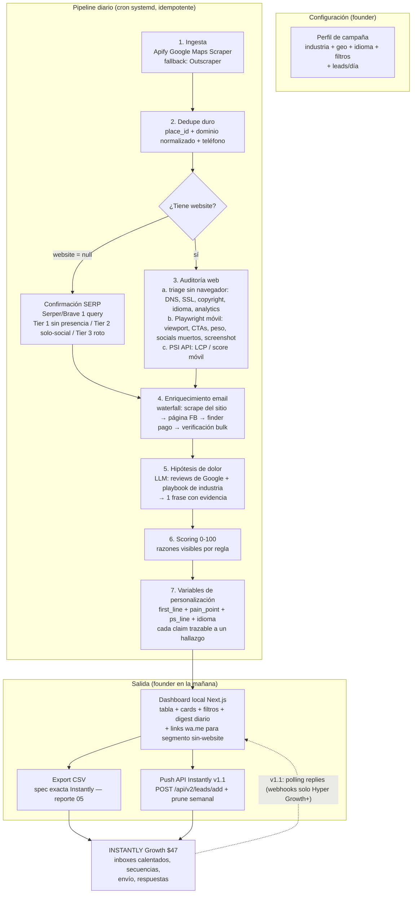
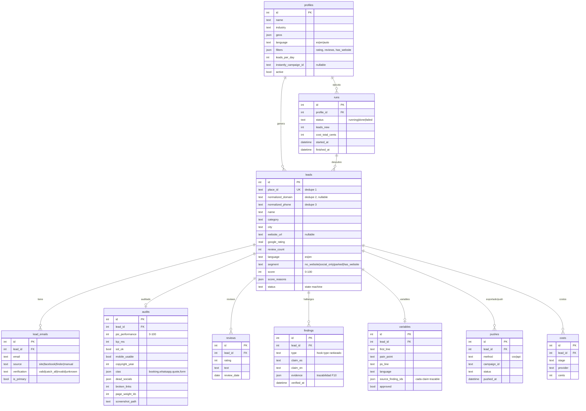

# 02 — Arquitectura del Sistema: ZerionStudio Lead Machine

> **Estado:** FINAL — contrato de Instantly y costos verificados (reportes 05 y 04).
> **Fecha:** 2026-07-14 · **Versión de spec:** V2

---

## 1. Principio rector

**Nuestro software es dueño de todo lo que pasa ANTES del envío** (datos, enriquecimiento, hallazgos, scoring, variables de personalización, presentación). **Instantly es dueño del envío** (warm-up, deliverability, secuencias, calendario de envío, bandeja de respuestas). No construimos nada que Instantly ya resuelva.

## 2. Stack elegido (sesgo a fortalezas del founder)

| Capa | Elección | Justificación |
|---|---|---|
| Lenguaje | **TypeScript** (todo el sistema) | Fortaleza #1 del founder; un solo lenguaje para pipeline + dashboard |
| Runtime pipeline | **Node.js 22 LTS** + scripts `tsx` | Workers de pipeline como procesos CLI idempotentes, fáciles de cronear |
| Dashboard | **Next.js 15 (App Router) + Tailwind + shadcn/ui** | UI "vistosa" y rápida con mínimo esfuerzo; API routes sirven los datos; un solo deploy |
| Base de datos | **SQLite** vía **Drizzle ORM** | Un archivo, cero administración, transaccional, suficiente hasta decenas de miles de leads; Drizzle da tipos end-to-end |
| Scraping/auditoría | **Playwright** (Chromium headless, emulación móvil) | Un solo navegador para auditoría + screenshot como material de venta |
| Auditoría de velocidad | **Google PageSpeed Insights API** (gratis) | Datos Lighthouse en hardware calibrado de Google; 25.000 consultas/día gratis — no auto-hostear Lighthouse |
| LLM | **Claude Haiku 4.5** vía `@anthropic-ai/sdk` — $1/$5 por MTok verificado ≈ $0.005/lead | Tareas cortas y estructuradas (resumen, dolor, variables); salida forzada con tool-use/JSON |
| Scheduler | **systemd timer** → `npm run pipeline -- --profile=<id>` | Nativo en Linux, logs en journald, reintentos controlados por el propio worker |
| Hosting | Máquina del founder (dev) → **VPS $6/mes** (producción) | El cron debe correr aunque la laptop esté apagada; DigitalOcean $6 (1 GiB) verificado |
| Secretos | `.env` + `dotenv` (nunca hardcodeados) | Requisito no funcional |

## 3. Diagrama de flujo



## 4. Componentes (código)

```
zerion-lead-machine/
├── src/
│   ├── db/               # esquema Drizzle + migraciones (SQLite)
│   ├── pipeline/
│   │   ├── run.ts        # orquestador idempotente por perfil (máquina de estados por lead)
│   │   ├── ingest/       # adaptador Apify + adaptador Outscraper (misma interfaz)
│   │   ├── dedupe.ts     # place_id, dominio normalizado, teléfono E.164
│   │   ├── audit/        # triage http/ssl → playwright móvil → cliente PSI
│   │   ├── enrich/       # waterfall de email + verificación + detección de idioma
│   │   ├── pain/         # minería de reviews + playbooks por industria (LLM)
│   │   ├── score.ts      # reglas de scoring con razones
│   │   └── variables.ts  # generación LLM de first_line / pain_point / ps_line
│   ├── export/
│   │   ├── instantly-csv.ts   # spec exacta de columnas (reporte 05) — ruta MVP
│   │   └── instantly-api.ts   # cliente API v2: bulk add + prune (v1.1)
│   ├── app/              # dashboard Next.js (tabla, cards, digest, filtros)
│   └── lib/              # costos por lead, logging (pino), retry con backoff
├── .env                  # APIFY_TOKEN, ANTHROPIC_API_KEY, INSTANTLY_KEY, ...
└── reports/              # esta documentación
```

**Reglas de ejecución:**
- Cada etapa es una transición de la máquina de estados del lead (`new → enriched → audited → scored → ready → exported/pushed`). Re-ejecutar el pipeline **no** repite trabajo hecho (idempotencia por estado + claves únicas).
- Toda llamada externa: retry ×3 con backoff exponencial; fallo persistente → lead marcado `error` con causa, el run continúa (graceful degradation).
- Cada llamada con costo (Apify, finder, verificador, LLM) registra centavos en la tabla `costs` → el dashboard muestra **costo por lead contactable** real.

## 5. Modelo de datos (SQLite / Drizzle)



**Notas de diseño:**
- `findings` es la tabla que garantiza F10: cada variable generada referencia `source_finding_ids` — ningún claim sin dato capturado detrás.
- `lead_emails` separada de `leads` porque el waterfall puede producir varias direcciones con distinta calidad; solo `is_primary + verification='valid'` se exporta.
- Tabla `suppression` (no dibujada): emails con opt-out — el exportador la consulta SIEMPRE antes de generar CSV/push (CAN-SPAM).
- `reviews` se guarda como insumo interno del LLM (nunca se republica contenido de Google — restricción de ToS, ver reporte 06).

## 6. Flujo diario (experiencia del founder)

1. **07:00** — systemd timer dispara `pipeline run --all-profiles`.
2. El pipeline ingesta N leads nuevos por perfil, deduplica contra TODO el histórico, enriquece, audita, puntúa y genera variables. Duración estimada a 50 leads: ~30-60 min (PSI es el cuello de botella, ver reporte 04).
3. **08:00** — el founder abre `localhost:3000` (o el VPS): digest del día — leads nuevos, top 10 por score, distribución por segmento, costo del batch.
4. Revisa los top N, des-selecciona los que no le gusten, corrige alguna `first_line` si quiere (editable inline), y hace clic en **Export CSV → Instantly** (MVP) o **Push** (v1.1).
5. Instantly hace el resto. Las respuestas se leen en Instantly (MVP); en v1.1 el webhook las sincroniza de vuelta.

## 7. Decisiones de arquitectura ya bloqueadas por evidencia (resumen)

| Decisión | Elección | Evidencia clave (ver reporte 07 para URLs) |
|---|---|---|
| Fuente de leads | Apify Google Maps Scraper (primaria) / Outscraper (fallback) | $4/1.000 lugares + $0,0005/review, todos los campos requeridos, website nullable |
| Places API oficial | **Rechazada** como fuente de base de datos | ToS prohíbe almacenar todo excepto `place_id` |
| Motor de auditoría | Híbrido: triage sin navegador + Playwright móvil + PSI API | PSI gratis (25k/día), Lighthouse self-hosted ruidoso e innecesario |
| Confirmación no-website | 1 query SERP (Serper 2.500 gratis → Brave $5/1k) | Google Custom Search API cerrada a nuevos clientes (muere ene-2027) |
| Envío | **Instantly Growth $47/mes** — CSV-first; API incluida en Growth; webhooks solo Hyper Growth+ | Verificado en pricing + help center oficial; cap de 1.000 contactos reclamable vía delete |
| Email discovery | Waterfall: crawler propio → FB About → Outscraper ($3/1k) → verificación 100% Reoon ($1,19/1k) | Hunter/Snov rechazados: 10-40× más caros y ciegos para el segmento sin-website |
| LLM | Claude Haiku 4.5 — $0,005/lead con trazabilidad claim→finding | Pricing oficial Anthropic, confirmado adversarialmente |
| Segmento sin-website | Links wa.me manuales desde dashboard (10-20/día); NO-GO API de WhatsApp para frío | Política de opt-in de Meta + benchmarks click-to-chat |

---
*Los costos y el funnel están en el reporte 04; el contrato CSV/API de Instantly en el 05; los scores de confianza por decisión en el 01.*
